# 🧠 Smart Model Router

**An intelligent LLM routing system that reduces inference costs by up to 99% by automatically directing prompts to the optimal model based on complexity.**

[](https://www.python.org/downloads/)
[](https://fastapi.tiangolo.com/)
[](https://opensource.org/licenses/MIT)

---

## 📋 Table of Contents

- [The Problem](#-the-problem)
- [The Solution](#-the-solution)
- [Architecture](#-architecture)
- [Key Features](#-key-features)
- [Performance](#-performance)
- [Quick Start](#-quick-start)
- [API Reference](#-api-reference)
- [Technical Deep Dive](#-technical-deep-dive)
- [Configuration](#-configuration)
- [Development](#-development)

---

## 🎯 The Problem

**LLM API costs are exploding.** Organizations using GPT or Gemini Pro for every request face:

| Challenge | Impact |
|-----------|--------|
| **Cost inefficiency** | 80% of prompts are simple tasks (summarization, translation) that don't need expensive models |
| **Latency variability** | Pro-tier models are 5-10x slower than lightweight alternatives |
| **No visibility** | Teams lack insight into which prompts actually need advanced reasoning |

**Real-world scenario:** A support chatbot processes 100K queries/day. If 70% are simple FAQ lookups routed through GPT-4o at $5/1M tokens, you're burning ~$350/day on tasks a $0.01 local model handles equally well.

---

## 💡 The Solution

Smart Model Router is a **drop-in proxy** that sits between your application and LLM providers. It analyzes each prompt and routes it to the cheapest capable model:

```mermaid
flowchart LR
    subgraph Input
        A["Summarize this email"] --> R
        B["Explain quantum computing"] --> R
        C["Design microservices arch"] --> R
    end
    
    R[Smart Model Router] --> D["Granite Local<br/>💰 $0.00001"]
    R --> E["Gemini Flash<br/>💰 $0.0003"]
    R --> F["Gemini Pro<br/>💰 $0.01"]
    
    D --> S["✅ 90-99% Savings"]
    E --> S
    F --> S
```



---

## 🏗️ Architecture


---

## ✨ Key Features

### 🧠 Intelligent Routing
- **LLM-Based Classification**: Uses a lightweight local model (Granite 4.0 Nano) to analyze prompt complexity
- **Rule-Based Fallback**: Heuristic scoring as a backup when LLM classification fails
- **Force Override**: API parameter to bypass routing for testing or specific use cases

### 🚀 Semantic Caching
- **Embedding-Based Similarity**: Uses `nomic-embed-text` (768-dim) for prompt embeddings
- **Redis Vector Search**: FindS similar prompts, not just exact matches
- **Configurable Threshold**: 92% default similarity for cache hits
- **72ms Cache Hits**: vs 5-18 seconds for full LLM calls

### 💰 Cost Optimization
- **Real-Time Cost Tracking**: Per-request cost calculation in USD
- **Baseline Comparison**: Shows savings vs always using Gemini Pro
- **Token-Level Granularity**: Separate input/output token pricing

### 🔐 Production-Ready
- **API Key Authentication**: SHA-256 hashed keys with rotation support
- **Rate Limiting Ready**: Architecture supports per-key throttling
- **Async Throughout**: Full async/await for high concurrency
- **Health Checks**: `/health` endpoint for load balancer integration

### 📊 Observability
- **Request Logging**: Every request logged to PostgreSQL
- **Cost Analytics**: Aggregate savings queries ready
- **Model Distribution**: Track which models serve which prompt types

---

## 📈 Performance

### Cost Savings (Real Test Data)

| Prompt Type | Without Router | With Router | Savings |
|-------------|----------------|-------------|---------|
| "Translate to Spanish" | $0.000208 | $0.000001 | **99.5%** |
| "Explain Python decorators" | $0.000416 | $0.000075 | **82%** |
| "Design a banking API" | $0.002 | $0.002 | 0% (correctly uses Pro) |

### Latency

| Scenario | Latency |
|----------|---------|
| First request (LLM classification + generation) | 3-18s |
| Semantic cache hit (similar prompt) | **72ms** |
| Exact cache hit | **2ms** |

---

## 🚀 Quick Start

### Prerequisites

- Docker & Docker Compose
- Python 3.11+ with `uv` package manager
- NVIDIA GPU (optional, for faster local inference)
- Google Cloud API key for Gemini

### Installation

```bash
# Clone the repository
git clone https://github.com/yourusername/smart-model-router.git
cd smart-model-router

# Configure environment
cp .env.example .env
# Add your GOOGLE_API_KEY to .env

# Start infrastructure (PostgreSQL, Redis Stack, Ollama)
docker-compose up -d

# Pull required models
docker exec router-ollama ollama pull granite4:350m
docker exec router-ollama ollama pull nomic-embed-text

# Install dependencies
uv pip install -e ".[dev]"

# Run database migrations
alembic upgrade head

# Start the API server
uvicorn src.main:app --reload --host 0.0.0.0 --port 8000
```

### First Request

```bash
# Create an API key
curl -X POST http://localhost:8000/v1/keys \
  -H "Content-Type: application/json" \
  -d '{"name": "my-first-key"}'

# Response: {"key": "smr_abc123...", "id": "...", ...}

# Make a completion request
curl -X POST http://localhost:8000/v1/complete \
  -H "X-API-Key: smr_abc123..." \
  -H "Content-Type: application/json" \
  -d '{"prompt": "Summarize: Python is a programming language."}'
```

### Response

```json
{
  "response": "Python is a versatile programming language known for...",
  "model_used": "granite4:350m",
  "difficulty_tag": "simple",
  "estimated_cost": 0.000001,
  "estimated_savings": 0.000207,
  "latency_ms": 1523,
  "cache_hit": false
}
```

---

## 📖 API Reference

### POST /v1/complete

Main completion endpoint with intelligent routing.

**Request:**
```json
{
  "prompt": "Your prompt here",
  "force_tier": "simple|medium|complex"  // Optional override
}
```

**Response:**
```json
{
  "response": "Generated text...",
  "model_used": "granite4:350m",
  "difficulty_tag": "simple",
  "estimated_cost": 0.000001,
  "estimated_savings": 0.000207,
  "latency_ms": 1523,
  "cache_hit": false
}
```

### POST /v1/keys

Create a new API key.

### GET /v1/keys

List all API keys (hashed, not raw).

### DELETE /v1/keys/{id}

Deactivate an API key.

### GET /health

Health check with database connectivity status.

---

## 🔬 Technical Deep Dive

### Prompt Classification

The router uses a two-stage classification approach:

1. **LLM-Based (Primary)**: Granite 4.0 Nano analyzes the prompt with a classification instruction:
   ```
   Classify this prompt: SIMPLE | MEDIUM | COMPLEX
   - SIMPLE: summarization, translation, simple Q&A
   - MEDIUM: explanations, code generation
   - COMPLEX: architecture design, multi-step reasoning
   ```

2. **Rule-Based (Fallback)**: Heuristic scoring based on:
   - Token count thresholds
   - Keyword detection (e.g., "architect", "debug", "optimize")
   - Code block presence
   - Instruction complexity

### Semantic Caching

```python
# Embedding generation (Ollama + nomic-embed-text)
embedding = await embeddings.embed("What is machine learning?")
# → [0.023, -0.156, 0.089, ...] (768 dimensions)

# Redis vector search (FT.SEARCH with KNN)
result = await redis.execute_command(
    "FT.SEARCH", "smr_semantic_idx",
    "*=>[KNN 1 @embedding $vec AS score]",
    "PARAMS", "2", "vec", query_bytes,
)

# If similarity >= 92%, return cached response
```

### Cost Calculation

```python
MODEL_PRICING = {
    "granite4:350m": {"input": 0.01, "output": 0.01},   # $/1M tokens
    "gemini-flash": {"input": 0.075, "output": 0.30},
    "gemini-pro":   {"input": 1.25, "output": 10.00},
}

# Savings = baseline_cost - actual_cost
# Baseline = always using gemini-2.5-pro
```

---

## ⚙️ Configuration

All settings via environment variables or `.env` file:

| Variable | Default | Description |
|----------|---------|-------------|
| `DATABASE_URL` | `postgresql+asyncpg://...` | PostgreSQL connection |
| `REDIS_URL` | `redis://localhost:6379/0` | Redis Stack connection |
| `GOOGLE_API_KEY` | - | Gemini API credentials |
| `OLLAMA_BASE_URL` | `http://localhost:11434` | Ollama server URL |
| `USE_LLM_ROUTER` | `true` | Enable LLM-based classification |
| `USE_SEMANTIC_CACHE` | `true` | Enable embedding-based caching |
| `CACHE_TTL_SECONDS` | `3600` | Cache entry TTL |

---

## 📁 Project Structure

```
smart-model-router/
├── src/
│   ├── api/
│   │   ├── routes.py        # FastAPI endpoints
│   │   ├── schemas.py       # Pydantic models
│   │   └── dependencies.py  # Auth & session injection
│   ├── core/
│   │   └── router.py        # LLM + Rule-based classification
│   ├── providers/
│   │   ├── base.py          # OllamaProvider
│   │   ├── gemini.py        # GeminiProvider
│   │   └── manager.py       # Tier routing & fallback
│   ├── services/
│   │   ├── cache.py         # Exact-match cache
│   │   ├── semantic_cache.py # Embedding-based cache
│   │   ├── embeddings.py    # Ollama embeddings
│   │   └── cost.py          # Cost calculation & logging
│   ├── db/
│   │   ├── models.py        # SQLAlchemy models
│   │   └── session.py       # Async session factory
│   ├── config.py            # Pydantic settings
│   └── main.py              # FastAPI app
├── tests/
│   ├── test_router.py       # Unit tests
│   └── test_integration.py  # E2E tests
├── alembic/                 # Database migrations
├── docker-compose.yml       # Infrastructure stack
└── pyproject.toml           # Dependencies
```

---

## 🧪 Development

```bash
# Run tests
pytest -v

# Format code
ruff format .

# Lint
ruff check .

# Type check
pyrefly check
```

---

## 🛣️ Roadmap

- [ ] **Streaming Responses**: SSE for real-time output
- [ ] **Dashboard UI**: Cost analytics visualization
- [ ] **OpenAI Compatibility**: Drop-in replacement for `/v1/chat/completions`
- [ ] **Multi-Tenant**: Organization-level API key scoping
- [ ] **Fine-Tuned Router**: Train classifier on production data
